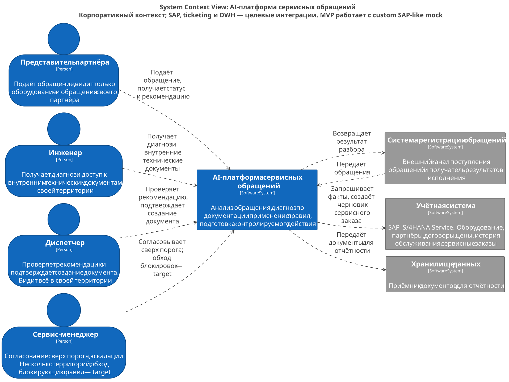
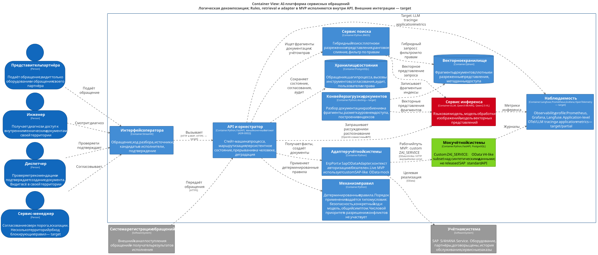
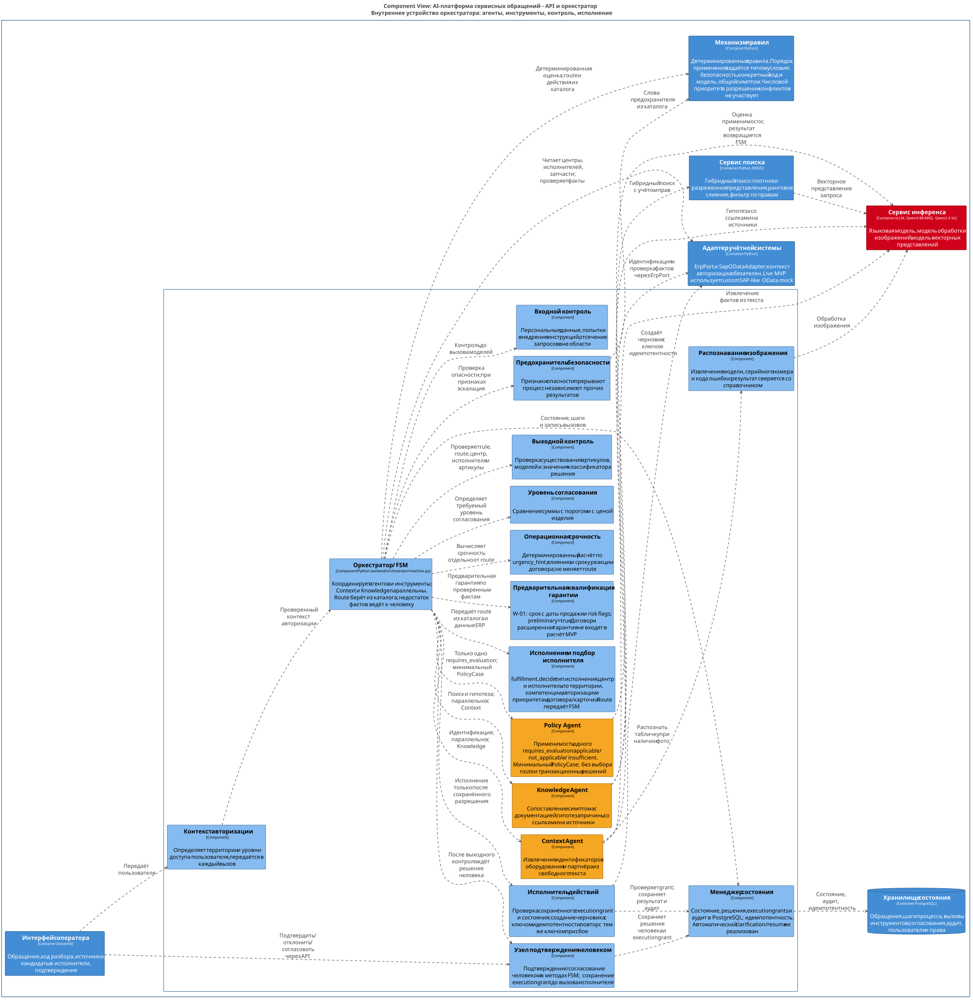
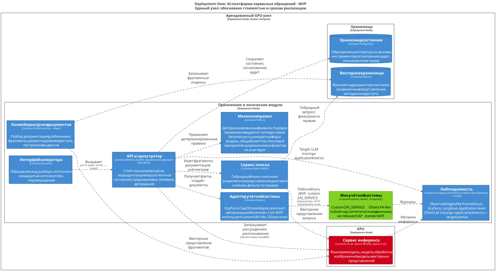
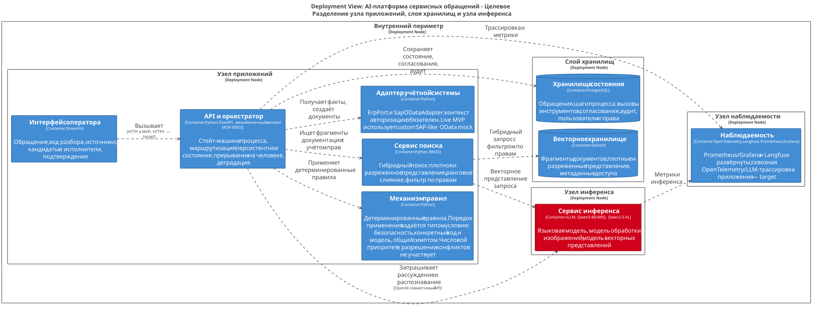

# Архитектура

Состав каталога и соглашения по диаграммам.

## Состав

| Файл | Содержание | Формат |
|---|---|---|
| [`workspace.dsl`](workspace.dsl) | Модель C4: контекст, контейнеры, компоненты оркестратора, развёртывание MVP и целевое | Structurizr DSL |
| [`data-model.md`](data-model.md) | Модель данных платформы, потоки данных в нормальном режиме, при отказах и приостановке | Markdown, Mermaid |
| [`sequence-and-states.md`](sequence-and-states.md) | Последовательности: основной путь, уточнение, деградация; состояния обращения | Markdown, Mermaid |
| [`model-card.md`](model-card.md) | Карточка модели: состав и версии моделей, назначение и границы применимости, метрики, управление изменениями | Markdown |
| [`technology-decisions.md`](technology-decisions.md) | Матрица технологических подходов с условиями пересмотра | Markdown |
| [`migration-path.md`](migration-path.md) | Переходы от MVP к целевому состоянию и их стоимость | Markdown |
| [`conformance.md`](conformance.md) | Соответствие документации и реализации | Markdown |

## Соглашения

- **Модель C4 ведётся только в `workspace.dsl`.** Представления: `C1_Context`, `C2_Containers`, `C3_Orchestrator`, `Deployment_MVP`, `Deployment_Target`.
- **Рендеры из `workspace.dsl`** кладутся в этот каталог под именем представления, например `C2_Containers.svg`. При изменении исходника они перегенерируются в том же коммите; SVG вручную не редактируются.
- **Остальные диаграммы — Mermaid внутри markdown.** GitHub отображает их без отдельного рендера, изображения для них не создаются.
- **Архитектурное решение сначала фиксируется в ADR** (`../adr/`), затем отражается в модели и в документах этого каталога.

## Границы представлений

Фактический состав MVP и известные ограничения перечислены в [conformance](conformance.md). `C1_Context` показывает корпоративный контекст: продуктивный SAP, ticketing и DWH — целевые интеграции. Рабочий MVP использует собственный SAP-like OData mock; совместимость с released SAP standard API не заявляется.

`C2_Containers` — логическая декомпозиция. В текущем Compose механизм правил, retrieval и ERP adapter исполняются внутри API; ingestion запускается командой. Поэтому блоки C2 и `Deployment_MVP` не соответствуют Docker-контейнерам один к одному. Один блок inference объединяет три model services. Langfuse/Prometheus/Grafana развёрнуты, но сквозная инструментализация приложения OpenTelemetry/LLM traces остаётся target; docling также относится к target.

`C3_Orchestrator` отражает вызовы текущего FSM: Context и Knowledge запускаются параллельно; Rule Engine выбирает правило, Policy оценивает только одно `requires_evaluation` через минимальный `PolicyCase`. Route берётся из каталога. Warranty, fulfillment/assignment, urgency, approval, выходной контроль и исполнение координирует FSM. Узел human gate — логическая ответственность методов подтверждения FSM, а не отдельный сервис. Черновик создаётся только после сохранения execution grant. Стрелки показывают зависимости/вызовы, не самостоятельную передачу управления агентами.

## Сгенерированные схемы

SVG содержат векторный текст и открываются отдельно по ссылкам. В узком preview GitHub крупные C2/C3 уменьшаются: для чтения подписей откройте SVG и увеличьте масштаб. Цвета: оранжевый — три агента, голубой — детерминированные компоненты, синий — контейнеры/модули, красный — inference, зелёный — мок MVP, серый — внешние системы.

### C1 — контекст

[Открыть C1_Context.svg](C1_Context.svg)



### C2 — контейнеры и логические модули

[Открыть C2_Containers.svg](C2_Containers.svg)



### C3 — оркестратор

[Открыть C3_Orchestrator.svg](C3_Orchestrator.svg)



### Развёртывание MVP

[Открыть Deployment_MVP.svg](Deployment_MVP.svg)



### Целевое развёртывание

[Открыть Deployment_Target.svg](Deployment_Target.svg)



## Воспроизведение рендеров

Использованы Structurizr **2026.09.19**, официальный exporter `plantuml/structurizr`, PlantUML **1.2026.8**, Graphviz **2.44.1**, Java **21**. Состав элементов и связей берётся только из DSL; промежуточные `.puml` автоматически экспортируются и не редактируются. Внешняя `theme default` не требуется: стили заданы в DSL. Отличия версии Graphviz и шрифтов ОС могут менять геометрию, но не модель.

Дистрибутивы: [Structurizr](https://docs.structurizr.com/binaries), [PlantUML 1.2026.8](https://github.com/plantuml/plantuml/releases/tag/v1.2026.8). Экспорт: [официальная документация Structurizr](https://docs.structurizr.com/export/plantuml).

Пример из корня репозитория (Bash; `TOOLS` и `OUT` — каталоги вне репозитория):

```bash
TOOLS=/path/to/docs-tooling
OUT=/path/to/generated-c4
java -jar "$TOOLS/structurizr-2026.09.19.war" validate \
  -workspace docs/architecture/workspace.dsl
java -jar "$TOOLS/structurizr-2026.09.19.war" export \
  -workspace docs/architecture/workspace.dsl \
  -format plantuml/structurizr -output "$OUT"
java -Djava.awt.headless=true -jar "$TOOLS/plantuml.jar" \
  -charset UTF-8 -tsvg "$OUT/*.puml"
for view in C1_Context C2_Containers C3_Orchestrator Deployment_MVP Deployment_Target; do
  cp "$OUT/structurizr-$view.svg" "docs/architecture/$view.svg"
done
```

После экспорта проверить все пять SVG, подписи и связи C3, выполнить `git diff --check`. Артефакты не требуют запущенного inference-стенда и не содержат реальных пользовательских данных.
