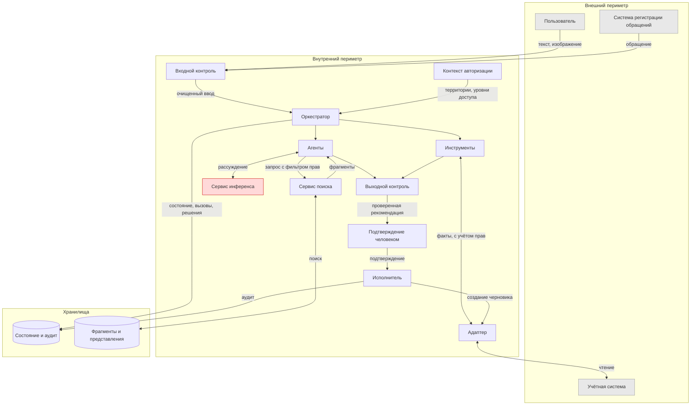
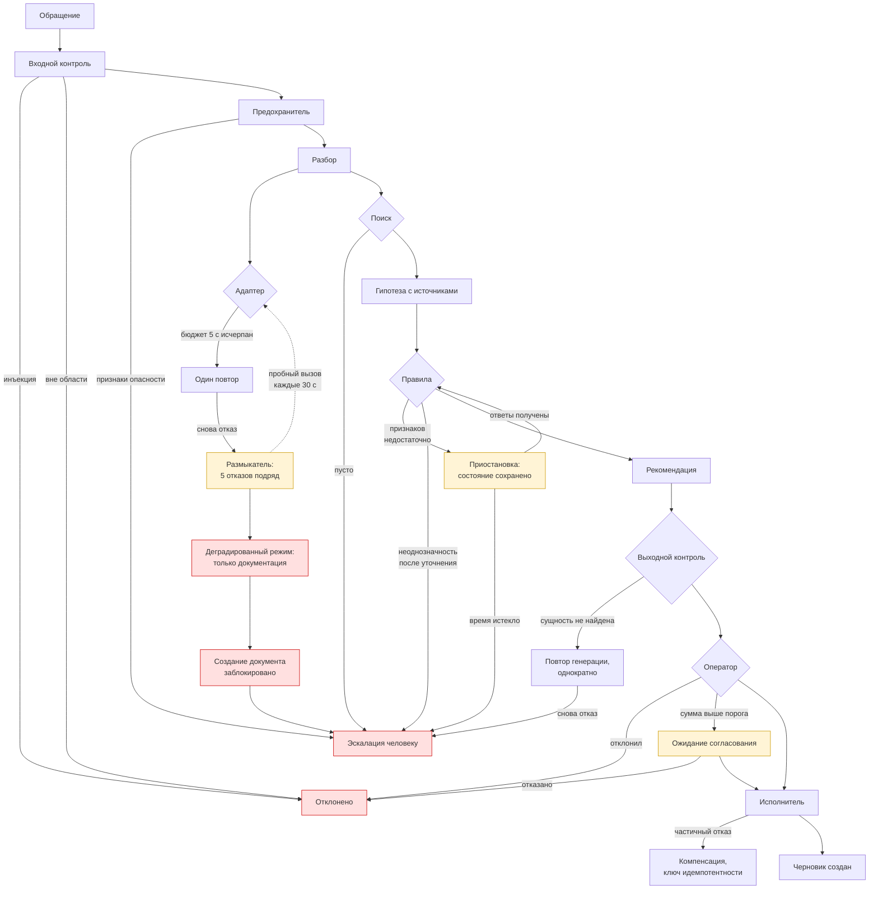

# Модель данных и потоки данных

| | |
|---|---|
| Версия | 0.2 |
| Дата | 15.09.2026 |
| Изменения в 0.2 | CANDIDATE: тип кандидата, причина отклонения, идентификатор центра; IDENTIFICATION: уровень «выведен»; раздел 3: состав составных полей версии набора артефактов |
| Связанные документы | PRD, ADR-0002, ADR-0003, ADR-0004 |

## 1. Принцип разделения данных

Платформа **не дублирует мастер-данные учётной системы**. Оборудование, партнёры, договоры, цены, остатки запчастей и история обслуживания остаются в учётной системе и запрашиваются через адаптер при каждом обращении.

В собственных хранилищах платформы находятся только:

1. **Состояние процесса** — то, чего в учётной системе нет и быть не должно: ход разбора обращения, вызовы инструментов, гипотезы, согласования.
2. **Знания** — фрагменты документации с векторными представлениями и метаданными доступа.
3. **Доступ и аудит** — пользователи, территории, права, история решений.

Ссылки на объекты учётной системы хранятся как внешние идентификаторы без копирования атрибутов.

Обоснование то же, что и при отказе от графа знаний в ADR-0003: копия данных создаёт вторую точку истины и задачу синхронизации, а выигрыша не даёт. Единственное исключение — снимок ключевых фактов на момент принятия решения (см. раздел 3).

## 2. Диаграмма сущностей

```mermaid
erDiagram
    TERRITORY ||--o{ SERVICE_ORGANIZATION : "включает"
    TERRITORY ||--o{ SERVICE_CENTER : "размещает"
    SERVICE_ORGANIZATION ||--o{ SERVICE_CENTER : "отвечает за"
    SERVICE_CENTER ||--o{ CENTER_BRAND_AUTH : "авторизован по"

    APP_USER ||--o{ USER_TERRITORY : "имеет доступ"
    TERRITORY ||--o{ USER_TERRITORY : "доступна"
    ROLE ||--o{ APP_USER : "назначена"
    APP_USER ||--o| PARTNER_BINDING : "ограничен партнёром"

    APP_USER ||--o{ SERVICE_REQUEST : "создал"
    SERVICE_REQUEST ||--o{ REQUEST_ATTACHMENT : "содержит"
    SERVICE_REQUEST ||--|| IDENTIFICATION : "имеет"
    SERVICE_REQUEST ||--o{ PROCESS_STEP : "проходит"
    SERVICE_REQUEST ||--o{ DIAGNOSIS : "получает"
    SERVICE_REQUEST ||--o| DECISION : "завершается"
    SERVICE_REQUEST ||--o{ AUDIT_EVENT : "порождает"

    PROCESS_STEP ||--o{ TOOL_CALL : "выполняет"
    DIAGNOSIS ||--o{ EVIDENCE : "опирается на"
    EVIDENCE }o--o| DOCUMENT_CHUNK : "ссылается на"
    EVIDENCE }o--o| RULE : "ссылается на"

    DECISION }o--|| RULE : "применённое правило"
    DECISION }o--o| SERVICE_CENTER : "рекомендованный центр"
    DECISION ||--o{ CANDIDATE : "предлагает"
    DECISION ||--o| APPROVAL : "требует"
    DECISION ||--o| WORK_ORDER_DRAFT : "порождает"

    WORK_ORDER_DRAFT ||--|| IDEMPOTENCY_KEY : "защищён"

    RULE }o--|| RULE_CLASS : "относится к"
    RULE }o--o{ ERROR_CODE : "срабатывает по"

    DOCUMENT ||--o{ DOCUMENT_CHUNK : "разбит на"
    DOCUMENT }o--|| CONFIDENTIALITY_LEVEL : "имеет уровень"
    DOCUMENT_CHUNK ||--o{ CHUNK_EMBEDDING : "представлен"

    SERVICE_REQUEST {
        uuid id PK
        string external_equipment_id "ссылка на учётную систему"
        string external_partner_id "ссылка на учётную систему"
        text raw_text "текст обращения как получен"
        string channel
        string status
        uuid territory_id FK
        timestamp created_at
    }

    IDENTIFICATION {
        uuid id PK
        uuid request_id FK
        string serial_number
        string confidence_level "подтверждён | распознан | выведен | со слов"
        boolean discrepancy_flag
        string source "текст | изображение | ручной ввод"
    }

    PROCESS_STEP {
        uuid id PK
        uuid request_id FK
        string step_name
        string actor "агент | инструмент | человек"
        string status
        jsonb state_snapshot
        string artifact_version FK "версия набора артефактов"
        timestamp started_at
        timestamp finished_at
    }

    ARTIFACT_VERSION {
        string id PK
        string code_commit
        string llm_model_revision
        string vision_model_revision
        string embedding_model_revision
        string prompt_version
        string rules_version
        string corpus_version
        string chunker_version
        string retrieval_config_version
        timestamp created_at
    }

    TOOL_CALL {
        uuid id PK
        uuid step_id FK
        string tool_name
        jsonb request_payload
        jsonb response_payload
        int duration_ms
        string outcome "успех | отказ | деградация"
    }

    DIAGNOSIS {
        uuid id PK
        uuid request_id FK
        text hypothesis
        string evidence_level "код ошибки | раздел документации | аналогия"
        timestamp created_at
    }

    EVIDENCE {
        uuid id PK
        uuid diagnosis_id FK
        string source_type "документ | правило"
        uuid chunk_id FK
        string rule_id FK
    }

    DECISION {
        uuid id PK
        uuid request_id FK
        string execution_mode "удалённо | выезд | мастерская"
        string fulfillment_type "внутреннее | внешнее"
        string classifier_value "значение из справочника решений"
        string warranty_preliminary "гарантийный | платный"
        boolean warranty_is_preliminary
        string applied_rule_id FK
        jsonb considered_rules "для решений, принятых агентом"
        uuid service_center_id FK
        timestamp created_at
    }

    CANDIDATE {
        uuid id PK
        uuid decision_id FK
        string candidate_type "исполнитель | сервисный центр"
        string external_technician_id "при candidate_type = исполнитель"
        string external_service_center_id "при candidate_type = сервисный центр"
        int rank
        text rationale
        string selection_basis "договор | карточка ИО | ранжирование"
        string rejection_reason "нет авторизации по бренду | нет компетенции | другая территория | недоступен в окно | нет запчасти"
    }

    APPROVAL {
        uuid id PK
        uuid decision_id FK
        string level
        string approver_role
        string status "требуется | получено | отклонено"
        boolean is_rule_override
        string override_reason
        uuid approved_by FK
        timestamp decided_at
    }

    WORK_ORDER_DRAFT {
        uuid id PK
        uuid decision_id FK
        string external_document_id "идентификатор в учётной системе"
        jsonb payload_snapshot "факты на момент создания"
        string status
        timestamp created_at
    }

    RULE {
        string id PK
        text condition_text
        string execution_mode
        string specificity "модель и код | общий симптом"
        int urgency_hint "операционная срочность, не порядок применения"
        string rule_class FK
        text prescribed_actions "передаётся дословно"
        string equipment_class
        string source_url
    }

    RULE_CLASS {
        string id PK
        string name "детерминированное | требует оценки | безопасность"
    }

    DOCUMENT {
        uuid id PK
        string title
        string doc_type
        string confidentiality_level FK
        string equipment_class
        string model_ref
        string source
    }

    DOCUMENT_CHUNK {
        uuid id PK
        uuid document_id FK
        text content
        int section_no
        string confidentiality_level "денормализовано для фильтрации"
        string equipment_class
    }

    APP_USER {
        uuid id PK
        string external_user_id
        string display_name
        string role_id FK
        boolean is_active
    }

    USER_TERRITORY {
        uuid user_id FK
        uuid territory_id FK
    }

    AUDIT_EVENT {
        uuid id PK
        uuid request_id FK
        uuid actor_user_id FK
        string event_type
        jsonb before_state
        jsonb after_state
        timestamp occurred_at
    }
```

## 3. Пояснения к спорным решениям

**Уровень конфиденциальности продублирован в фрагменте документа.** Формально он выводится из документа, но фильтрация по правам выполняется в самом поисковом запросе, до ранжирования (ADR-0003). Соединение с таблицей документов на этом этапе невозможно, поскольку фильтр применяется в векторном хранилище. Денормализация здесь — не небрежность, а условие корректной работы разграничения доступа.

**Снимок фактов в черновике документа.** Единственное место, где данные учётной системы копируются. Основание: необходимо знать, на каких именно значениях было принято решение, поскольку цена, остаток и статус договора меняются. Снимок неизменяем: служит для аудита и повторения той же записи с ключом идемпотентности; не заменяет источник мастер-данных для нового разбора.

**Рассмотренные правила сохраняются, а не только применённое.** Фиксируется весь набор кандидатов Rule Engine и отдельно оценка применимости выбранного правила от Policy Agent. Без этого невозможно разобрать, почему выбран именно этот способ устранения, а требование объяснимости заявлено в ADR-0004.

**Кандидаты сохраняются вместе с отклонёнными.** Сущность `CANDIDATE` хранит и выбранного исполнителя, и отклонённых — как исполнителей, так и сервисные центры (`candidate_type`). Причина отклонения — код из закрытого перечня (`rejection_reason`), а не свободный текст: только так проверяемо, почему, например, свободный собственный инженер не назначен на гарантийный случай, когда у мастерской нет авторизации по бренду. Пустое значение означает, что кандидат не отклонён.

Идентификатор кандидата хранится в одном из двух полей — `external_technician_id` или `external_service_center_id`. Заполнено ровно одно, соответствующее `candidate_type`, и это обеспечивается ограничением схемы, а не соглашением. Единое поле, тип ссылки в котором задаётся соседней колонкой, отклонено: такую ссылку схема не проверяет, и ошибка обнаружилась бы не при записи, а при чтении — когда кандидата попытаются показать оператору.

**Признак обхода правила вынесен в отдельное поле согласования.** Обход блокирующего правила пользователем с расширенными полномочиями (PRD, принцип 5) должен быть отличим от обычного согласования при разборе.

**Версия набора артефактов фиксируется в каждом шаге процесса.** Результат работы системы зависит не только от кода, но и от версий моделей, формулировок запросов к ним, свода правил, состава корпуса и параметров поиска. Без фиксации этого набора невозможно ответить, почему одно и то же обращение месяц назад было разобрано иначе.

**Состав составных полей версии.** Два поля `ARTIFACT_VERSION` собраны из нескольких артефактов; изменение любого из них меняет поле:

- `rules_version` — хеш свода правил (машиночитаемая часть `rules.yaml` и тексты правил `04_decision_rules.csv`), справочника кодов ошибок (`02_error_codes.csv`) и словарей входного контроля (`backend/guardrails/input/patterns.yaml`);
- `prompt_version` — по каждому агенту и инструменту с моделью: формулировки запроса (системная часть, пользовательская часть, текст повтора), схема структурированного вывода и параметры вызова (температура, предел длины ответа, отключение режима размышления, принуждение схемы на стороне сервера). Запись вида `context:<хеш>; plate:<хеш>; knowledge:stub; policy:stub`, где `stub` — заглушка без модели.

Ревизии самих моделей — в отдельных полях `llm_model_revision`, `vision_model_revision`, `embedding_model_revision`: immutable Hugging Face commit SHA из `LLM_MODEL_REVISION`, `VISION_MODEL_REVISION`, `EMBED_MODEL_REVISION`. Это не repository ID: `LLM_MODEL_ID`, `VISION_MODEL_ID`, `EMBED_MODEL_ID` отдельно задаются в конфигурации. Bootstrap и vLLM используют те же SHA; без них запуск с моделями запрещён. Служебные команды без инференса могут не задавать ревизии; тестовые наборы явно маркируются `stub`, а не выдают model ID за revision. Изменение SHA любой модели меняет ARTIFACT_VERSION.

Поскольку обучение и дообучение не выполняются (ADR-0005), классический реестр обученных моделей неприменим. Его роль выполняет версионирование набора артефактов: изменение любого из них порождает новую версию, ссылка на которую сохраняется вместе с шагом процесса.

**Поле срочности переименовано и не управляет порядком правил.** Исходное числовое поле приоритета в своде правил переименовано в `urgency_hint`. Основание: прежнее наименование читается как порядок применения, тогда как по ADR-0004 (редакция 2) порядок задаётся типом условия — безопасность, затем конкретная модель и код, затем общий симптом. Числовое значение означает операционную срочность и участвует в отдельном расчёте после выбора технического маршрута. Для выбора между равноправными правилами введено поле `specificity`.

Не следует путать с цепочкой приоритетов при подборе исполнителя (договор, карточка оборудования, ранжирование) — это иное понятие, оно сохраняется.

**Права пользователя не хранят территорию как строку.** Связь пользователя с территориями сделана отдельной таблицей: сервис-менеджер имеет доступ к нескольким территориям, и это должно быть отношением, а не перечислением через разделитель.

## 4. Потоки данных

### Нормальный путь

### Потоки при отказах и приостановке

Нормальный путь недостаточен: он не показывает, что происходит при недоступности зависимости, при приостановке на уточнении и при отклонении рекомендации.

Каждый путь отказа ведёт либо к отклонению, либо к человеку. Ни один не ведёт к выдаче результата, полученного домысливанием. Состояния ожидания выделены отдельно: приостановка на уточнении, ожидание согласования и разомкнутое состояние размыкателя — это места, где процесс живёт во времени и требует ограничения по длительности.

**Границы, которые видны на схеме.**

Персональные данные партнёров пересекают границу внутреннего периметра только в направлении учётной системы, которая находится в том же контуре. Наружу к внешним сервисам генеративных моделей потоков нет: сервис инференса размещён локально (ADR-0001).

Все обращения к учётной системе и к поиску проходят с контекстом авторизации. Прямых стрелок от агентов к адаптеру и к учётной системе нет: агенты работают только через инструменты.

Единственная стрелка на запись в учётную систему исходит от исполнителя и только после узла подтверждения человеком.

## 5. Соответствие критериям приёмки

| Критерий | Как обеспечивается моделью данных |
|---|---|
| AC-4 | Уровень конфиденциальности во фрагменте, фильтр в запросе; вызовы фиксируются в TOOL_CALL и проверяемы по трассировке |
| AC-5 | IDEMPOTENCY_KEY, связанный с черновиком документа |
| AC-9 | IDENTIFICATION с уровнем достоверности и признаком расхождения |
| AC-10 | APPROVAL с признаком обхода правила и причиной |
| AC-2 | EVIDENCE обязательна для DIAGNOSIS; отсутствие записей блокирует выдачу |
| AC-8 | Правило безопасности выделено отдельным классом в RULE_CLASS |
