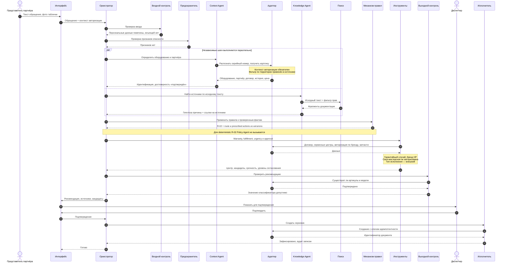
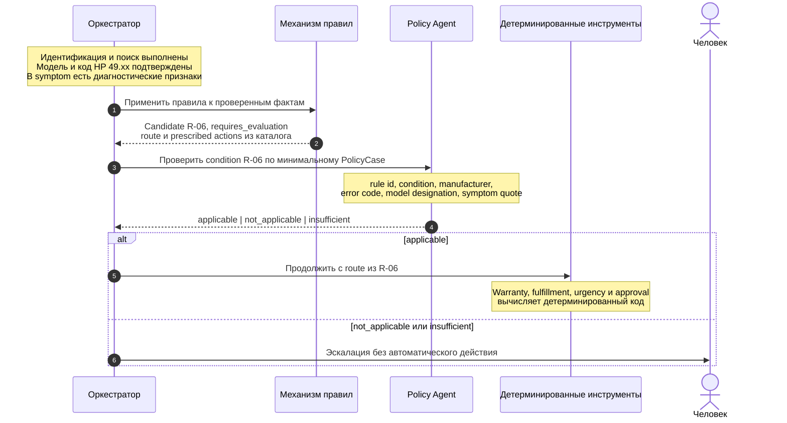
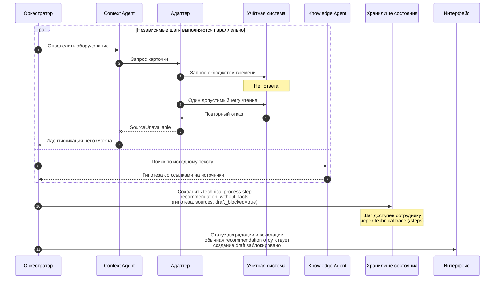
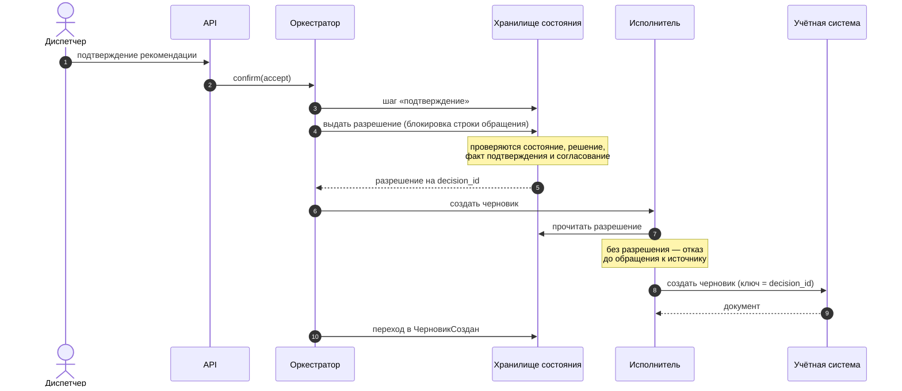

# Диаграммы последовательности и состояний

| | |
|---|---|
| Версия | 0.5 |
| Дата | 25.09.2026 |
| Связанные документы | PRD 0.3, ADR-0002, ADR-0004, ADR-0006, ADR-0007, ADR-0008 |
| Изменения в 0.5 | Уточнена семантика R-06: Rule Engine выбирает candidate по model+code, Policy проверяет диагностическое условие remote-ветки по symptom facts |
| Изменения в 0.4 | Диаграммы сверены с runtime: Policy только оценивает `requires_evaluation`, deterministic path обходит Policy, circuit breaker и clarification/resume отмечены как нереализованные |
| Изменения в 0.3 | Добавлены границы реализованного Policy Agent в разделе 2 |
| Изменения в 0.2 | Добавлен раздел 5: разрешение на исполнение между решением человека и записью в учётную систему |

Разделение по трём диаграммам сознательное: полный сценарий со всеми ветвлениями на одной диаграмме нечитаем. Основной путь показывает deterministic rule, второй — фактическую оценку `requires_evaluation`, третий — деградацию.

## 1. Основной сценарий

Случай, когда применимое правило детерминировано и уточнение не требуется.

Существенные места на схеме: контекст авторизации передаётся в каждый вызов адаптера; Context и Knowledge идут параллельно (ADR-0007), поэтому Knowledge начинает retrieval по исходному тексту и не ждёт подтверждённой карточки оборудования; индекс решённых случаев в MVP отсутствует. R-02 исполняется без Policy Agent. Route и prescribed actions возвращает каталог правил, а warranty, fulfillment, urgency и approval вычисляет детерминированный код. Единственная запись выполняется после подтверждения человеком и защищена ключом идемпотентности.

## 2. Оценка правила `requires_evaluation`

Случай правила, требующего оценки.

Автоматического пакета вопросов, приостановки и возобновления по ответу в текущем MVP нет. Это принятое направление развития ADR-0008, но фактическое safe behavior сейчас — эскалация человеку.

### Что из этого реализовано

Диаграмма выше показывает только текущий runtime.

| Элемент диаграммы | Фактически |
|---|---|
| Определение правила, требующего оценки | Механизм правил, детерминированно |
| Оценка правила агентом | Policy Agent, реализован |
| Выбор способа выполнения работ агентом | Способ берётся из самого правила: агент его не выбирает |
| `not_applicable`, `insufficient` или невалидный ответ после retry | Эскалация человеку без draft |
| Пакет уточняющих вопросов, приостановка и resume | Не реализованы; target ADR-0008 |

Policy Agent интерпретирует только правила, размеченные в своде как требующие оценки, и отвечает на единственный вопрос — применимо ли правило к проверенным фактам: `applicable`, `not_applicable` или `insufficient`. Для R-06 механизм правил выбирает candidate по проверяемым model+code, а Policy Agent проверяет по symptom facts, выполняется ли диагностическое условие remote-ветки: связь с заданием, очередью или подключением и отсутствие автономного воспроизведения без USB/LAN. Если признаки отсутствуют или противоречат условию, автоматический route не применяется и обращение передаётся человеку. Агент не выбирает способ выполнения работ, не квалифицирует гарантию, не подбирает сервисный центр и исполнителя, не определяет стоимость, не обращается к учётной системе и к поиску и не создаёт записей. Транзакционных решений он не принимает: всё перечисленное остаётся за кодом платформы.

Ему передаются идентификатор и условие правила, производитель, код ошибки, обозначение модели и описание неисправности — и ничего сверх этого. Ссылки в ответе проверяются по именам переданных фактов, чужие идентификаторы и решения платформы в обосновании запрещены. Любое сомнение — отсутствие признаков, невалидный ответ после повтора, ссылка на факт, которого не было, истечение бюджета, недоступность сервиса инференса — даёт `insufficient`, и обращение уходит человеку по тому же пути, что и раньше у заглушки.

## 3. Деградация при отказе учётной системы

Общее правило деградации: система сообщает о недостатке данных и передаёт решение человеку, но не восполняет пробел предположением. Адаптер ограничивает время и число повторов; circuit breaker в runtime не реализован.

## 4. Состояния обращения

Таблица состояний содержит зарезервированную точку `ОжиданиеУточнения` из ADR-0008, но текущий оркестратор в неё не переходит: при недостатке признаков он сразу выбирает `Эскалировано`. Переходы, помеченные как target, описывают направление эволюции, а не работающий clarification/resume MVP.

```mermaid
stateDiagram-v2
    [*] --> Принято

    Принято --> Отклонено: не прошло входной контроль
    Принято --> Эскалировано: признаки опасности
    Принято --> Разбор

    Разбор --> ОжиданиеУточнения: target; runtime не использует
    Разбор --> Эскалировано: источники не найдены
    Разбор --> РекомендацияГотова
    Разбор --> ДеградированныйРежим: источник фактов недоступен

    ОжиданиеУточнения --> Разбор: target; ответы получены
    ОжиданиеУточнения --> Эскалировано: target; время истекло
    ОжиданиеУточнения --> Эскалировано: target; неоднозначность сохранилась

    ДеградированныйРежим --> РекомендацияБезФактов
    РекомендацияБезФактов --> Эскалировано: требуется решение человека

    РекомендацияГотова --> ОжиданиеПодтверждения
    ОжиданиеПодтверждения --> Отклонено: диспетчер отклонил
    ОжиданиеПодтверждения --> ОжиданиеСогласования: сумма выше порога
    ОжиданиеПодтверждения --> ЧерновикСоздан: подтверждено

    ОжиданиеСогласования --> ЧерновикСоздан: согласовано
    ОжиданиеСогласования --> Отклонено: отказано

    ЧерновикСоздан --> [*]
    Эскалировано --> [*]
    Отклонено --> [*]

    note right of Эскалировано
        Терминальное состояние.
        Дальнейшее решение
        принимает человек
    end note

    note right of РекомендацияБезФактов
        Создание документа
        заблокировано
    end note

    note right of ОжиданиеУточнения
        Зарезервировано в модели.
        Runtime MVP не входит
        в это состояние.
    end note
```

Три терминальных состояния из семи достижимых ведут к человеку. Это не недостаток покрытия, а следствие принципа: при недостатке оснований система передаёт решение, а не принимает его.

## 5. Разрешение на исполнение

Модель состояний говорит, что запись в учётную систему возможна только из ожидания подтверждения или ожидания согласования. Этого недостаточно: между проверкой состояния и обращением к источнику проходит время, за которое решение человека может быть отменено. Поэтому решение человека фиксируется отдельной записью — разрешением на исполнение (EXECUTION_GRANT), и исполнитель проверяет его сам.

Что это даёт и чего стоит:

- **Разрешение принадлежит решению.** В нём записан `decision_id`; исполнитель сверяет его с текущим решением обращения и берёт из него ключ идемпотентности. Разрешение, выданное на другое решение, к исполнению не принимается.
- **Прямой вызов исполнителя ничего не пишет.** Проверку выполняет он сам, а не только автомат: без разрешения, при несовпадении решения, при неполученном согласовании или в отклонённом состоянии обращения вызова к источнику не происходит вовсе.
- **Отказ и разрешение сериализуются.** Обе операции берут строку обращения блокировкой `SELECT … FOR UPDATE` в своей транзакции, поэтому происходит ровно одна: либо отказ успевает раньше и разрешение уже не выдаётся по состоянию, либо разрешение выдано и отказ отклоняется.
- **После выданного разрешения отказ человека не принимается.** Это осознанная плата за отсутствие отдельного состояния «Исполнение»: обращение, по которому решение уже принято, нельзя отклонить задним числом.
- **Сбой записи не заканчивает процесс.** Если учётная система ответила отказом после выдачи разрешения, обращение остаётся в ожидании подтверждения, документа нет, отклонить его уже нельзя. Штатный путь — повторить исполнение после восстановления источника: ключ идемпотентности тот же, поэтому повтор даёт тот же документ, а не второй.

Отдельного состояния «Исполнение» в модели нет сознательно: разрешение решает ту же задачу записью в хранилище, не увеличивая число состояний автомата.
